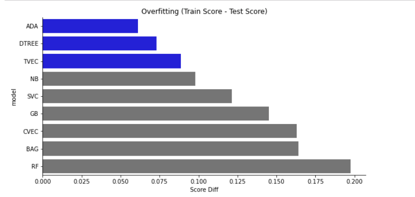

# Project 3 - Subreddit Classification (APIs & NLP)


## Introduction:

***Reddit*** is a social platform where members post content that is curated based on topics and promoted through voting.
Reddit is composed of hundreds of sub-communities, known as subreddits. In this project, i choose two subreddits, namely Nutrition and Keto.

***Nutrition*** A subreddit for the discussion of nutrition science.  Macronutrients, micronutrients, vitamins, diets, and nutrition news are among the many topics discussed. 

***Keto*** The Ketogenic Diet is a low carbohydrate method of eating. Place to share thoughts, ideas, benefits, and experiences around eating within a Ketogenic lifestyle. 

## Directory Structure
<details>
  <summary>Expand here</summary>

```
Project 3 - Subreddit Classification (APIs and NLP)
|__ codes
|   |__ 01_Data_Prep_reddit-via-pushShift.ipynb   
|   |__ 02_EDA_Subreddits-NutriKeto.ipynb   
|   |__ 03_Model_Tuning.ipynb
|   |__ cv_analyse.py
|__ datasets
|   |__ subr_nutrition.csv      
|   |__ subr_keto.csv        
|   |__ combined_subr.csv        
|__ image
|   |__ man.jpg
|   |__ metric1.png
|   |__ metric2.png
|   |__ metrics_score.png    
|   |__ Overfitting.png
|__ presentation
|   |__ NLP_Classification_NutriKeto.pdf  
|__ README.md
```
</details>

# The Data Science Process

## Problem Statement
- Can we create a model that can classify posts from two different subreddits based on their title?


## Data Collection

- We scrapped around 2000 post for each subreddits via Reddit's pushshift API . Since Keto is more active and have more members, it reached the first 2000 post on Jan 30, 2022. Nutrition’s reached 2000 post on Feb 14, 2022.

***Sources:***

[r/Nutrition](https://www.reddit.com/r/nutrition.json)
        
[r/Keto](https://www.reddit.com/r/keto.json)


## Cleanup and Pre-processing 
        
- Cleanup Author that are from AutoModerator 
- Remove duplicates in Ttile
        
- ***Tokenizing*** (lower case and removed punctuations) 
- ***Stemming*** (transforms a word into its root form, e.g. eating/eats to eat, losing/loses to lose, why to whi, does to doe)

*The selftext is mostly removed, so in this project we will focus more on the ***Title*** only.*


## Modeling and Tuning:
We built several Classification models (DecisionTreeClassifier, SVC, RandomForestClassifier, CountVectorizer, AdaBoostClassifier,GradientBoostClassifier,  BaggingClassifier, TFIDFVectorizer) and tuned each models by specifiying hyperparameters via GridSearch.


BaggingClassfier and TFIDFVectorizer are the top 2 best models in terms of Score or Accuracy.


### Overfitting

Most of the models have overfitting problems. This is a limitation that has never been addressed by this project. Further tuning of hyperparameters might able to mitigate this problem.





- ***DTREE, ADA, SVC*** = Train Score is 10% difference from Test Score
- ALL OTHERS = Train Score is 15% or more % difference from Test


### Metrics

- ***Sensitivity*** is a measure of the proportion of actual positive cases that got predicted as positive (or true positive). Sensitivity is also termed as Recall.
- ***Specificity*** is a measure of the proportion of actual negative cases that got predicted as negative (or true negative).
- ***Precision evaluates*** the fraction of correctly classified instances or samples among the ones classified as positives.
- ***F-score or F1 Score*** is a measure of a prediction's accuracy. It is calculated from the precision and recall/sensitivity of the test.


***TFIDFVectorizer*** wins Accuracy, Sensitivity and F1 Score
***BaggingClassifier*** wins Specificity and Precision


# Summary:
- To answer our ***Business Problem***: Yes, we have selected the best model that can classify posts from two different subreddits based on their title.

- We selected ***TFIDF Vecotirizer*** as our best model amongst all models for this classification project, as it is highest not just in Accuracy but also in F1-Score, as we want to balance Sensitivity and Specificity. It is also fast and easy to build with consistent result compared to ensemble methods like Bagging where data is randomly selected. In terms of interpretability, we can also look at the coefficients to validate the words that have highest correlation to wach subreddits.


## Recommendation:
- Tuning of hyperparameters to overcome overfitting
- Include other features like self-text and probably sentiment analysis score might improve our metrics.
- Include images or videos in our anaysis for more accurate prediction (which requires more knowledge on different ML domains)


